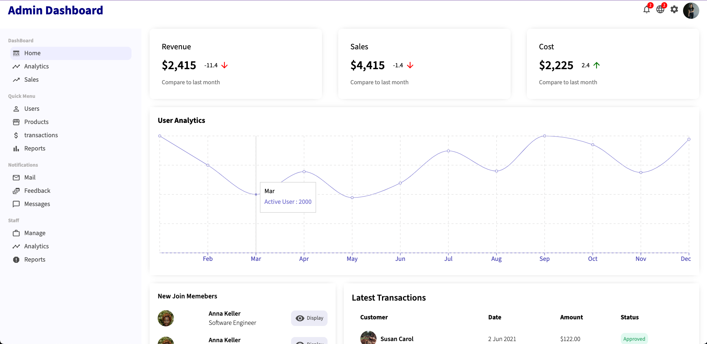
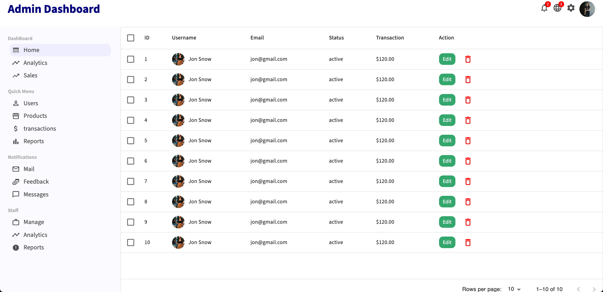
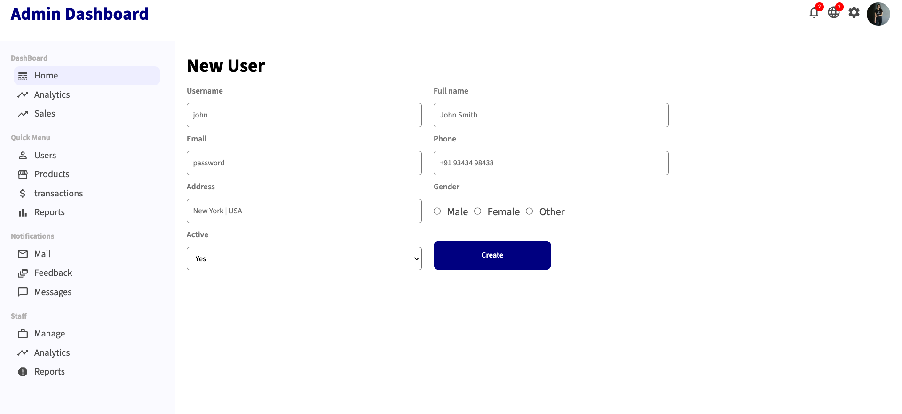
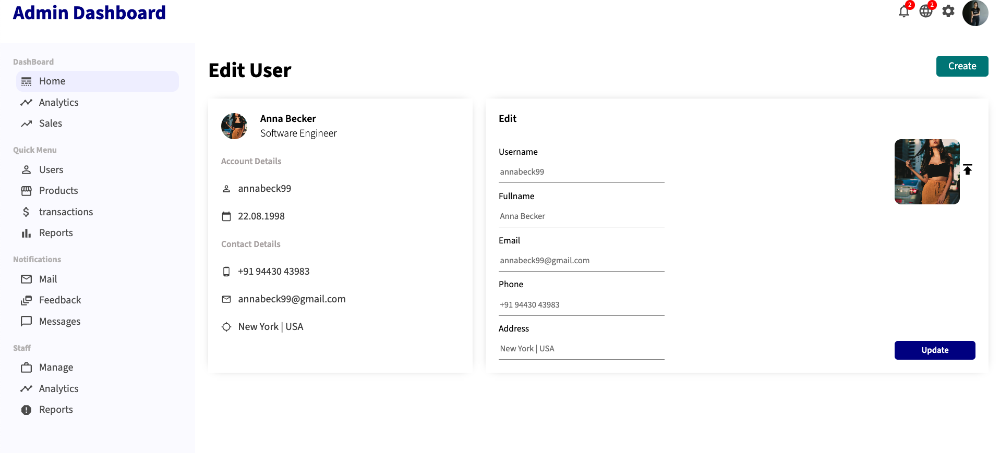
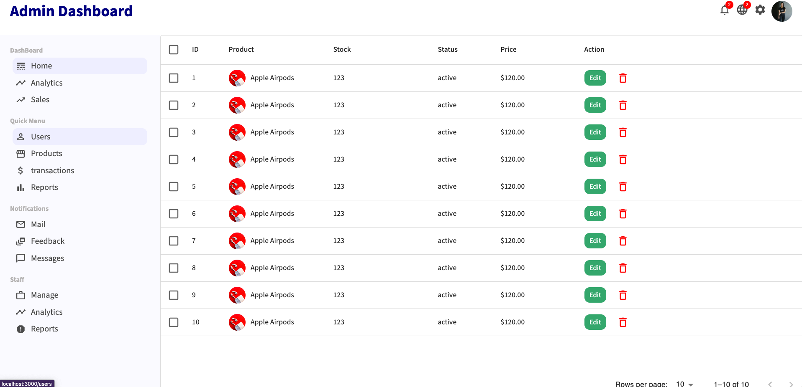
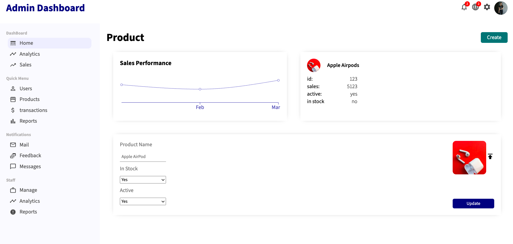
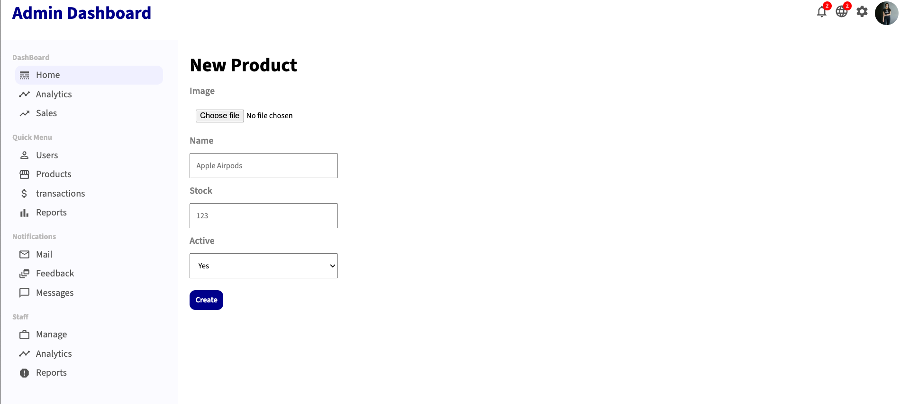

# React Admin Dashboard

Admin Dashboard is used to maintain products list and and admins can edit,delete and create products for a enterpise.

## Features

- User creation,deletion and updation
- Charts with Sales data of a product
- Product creation,deletion and updation

## Technologies Used

- **HTML**: Used for structuring the web pages.
- **CSS**: Used for styling and layout.
- **JavaScript**: Used for implementing dynamic behavior on the client-side.
- **React**: Used for building a modular and scalable user interface.
- **React-Router-dom**: Used for Routing to different pages.
- **Material-UI**: Used for icons & displaying users and products in a data grid .

## Prerequisites

Before you begin, ensure you have the following installed on your machine:

- [Node.js](https://nodejs.org/)
- [npm](https://www.npmjs.com/) (Node Package Manager)

## Installation

1. **Clone the repository:**

   ```bash
   https://github.com/manu-git-b-s/admin_dashboard.git
   ```

2. **Navigate to the project directory:**

   ```bash
   cd admin_dashboard
   ```

3. **Visual Code:**

   ```bash
   code .
   ```

4. **Install dependencies:**

   ```bash
   npm install http://localhost:3000
   ```

5. **Port:**

   ```bash
   http://localhost:3000
   ```

## Usage

1. **Start the development server:**

   ```bash
   npm run dev
   ```

2. **Open your browser and visit [http://localhost:3000](http://localhost:3000).**

3. **Explore the Admin Dashboard and have fun! 🎉**

## Contributing

We welcome contributions! To contribute to this project, please follow the guidelines outlined in [CONTRIBUTING.md](CONTRIBUTING.md).

## Feedback

If you have any questions, issues, or suggestions, feel free to [open an issue](https://github.com/manu-git-b-s/admin_dashboard.git/issues).

## Demo / Deployment Link

[React-Admin-Dashboard](https://admin-dashboard-manu.netlify.app/)

```bash
https://admin-dashboard-manu.netlify.app/
```

## Acknowledgements

Thanks lama for helping me create this beatiful admin dashboard through your youtube video
[Lamadev Youtube channel](https://www.youtube.com/@LamaDev)

## Screenshots of Pages

# 1. Home page displays Admin dashboard



# 2. Displays all users in a data-grid



# 3. Displays new user page



# 4. displays edit user page



# 5. Displays all products in a data-grid



# 6. Displays Product details page



# 7. Displays new product page


